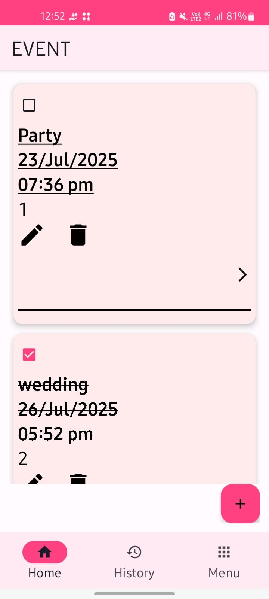
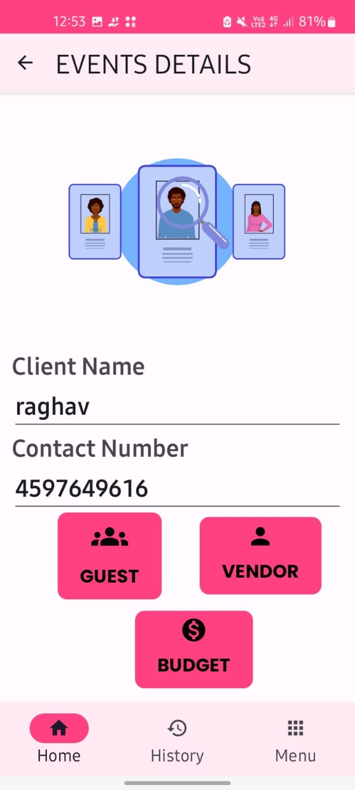
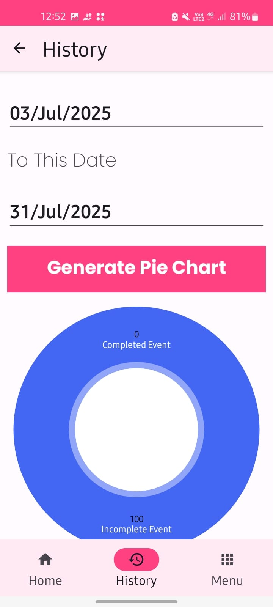
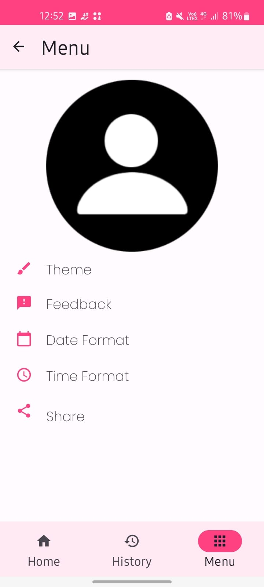

# 🎉 Elite Event App

A simple and efficient Android event management app built using **Kotlin**, **Room Database**, and **XML UI**. This app allows users to add and track events, vendors, guests, and budgets — all stored locally on the device.

---

## 🚀 Features

- 📅 Add and manage events
- 👥 Manage customer and guest details
- 💰 Add event budget and vendor details
- 📖 View event history:
  - ✅ Completed Events
  - ❌ Pending/Incomplete Events
- 🧭 Bottom Navigation Bar:
  - 🏠 Home
  - 📜 History
  - 👤 Profile
- 🗃 Local storage with **Room Database**
- 🖼 Clean XML-based UI

---

## 📱 Screenshots

| Home | Event Details | History |
|------|-----------|---------|
|  |  |  |  |

---

## 🛠 Built With

- 💻 **Kotlin** – Business logic and functionality
- 🧩 **Room Database** – Local storage and data persistence
- 🎨 **XML UI** – Clean and responsive interface
- ⚙️
